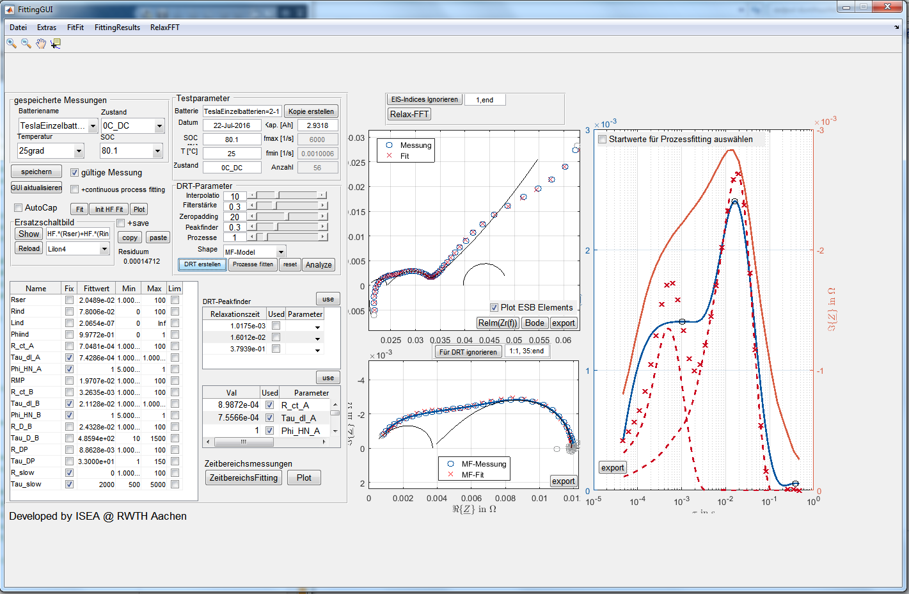
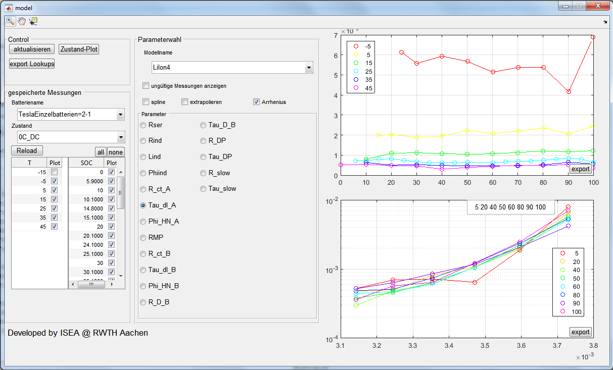

# FittingGUI
GUI for Fitting Models to measured Impedance Spectra with focus on Lithium Ion Batteries

# Overview
A brief overview of how the FittingGUI looks like is presented below

The FittingResult GUI allows to see an overview of the fitting results over several states (Temperature, SOC)

